# MyTabungan - Aplikasi Manajemen Keuangan Pribadi

<div align="center">


**Kelola Keuangan Anda dengan Mudah dan Modern**

[](https://php.net)
[](https://mysql.com)
[](https://tailwindcss.com)
[](https://chartjs.org)

</div>

---

## ✨ Fitur

### 🏠 Landing Page


Halaman utama yang menyambut pengguna dengan desain modern. Halaman ini berfungsi sebagai pintu masuk aplikasi untuk pengguna baru.

**Fitur halaman ini:**

- ✅ Desain modern dengan animasi smooth scroll
- ✅ Navbar responsive dengan hamburger menu untuk mobile
- ✅ Auto-hide navbar saat scroll ke bawah
- ✅ Showcase fitur-fitur unggulan aplikasi
- ✅ Call-to-Action (CTA) untuk mendaftar atau login

---

### 🔐 Autentikasi (Login, Register, Lupa Password)

| Login                          | Register                           | Lupa Password                                 |
| ------------------------------ | ---------------------------------- | --------------------------------------------- |
| 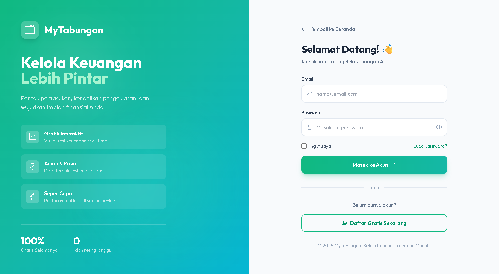 | 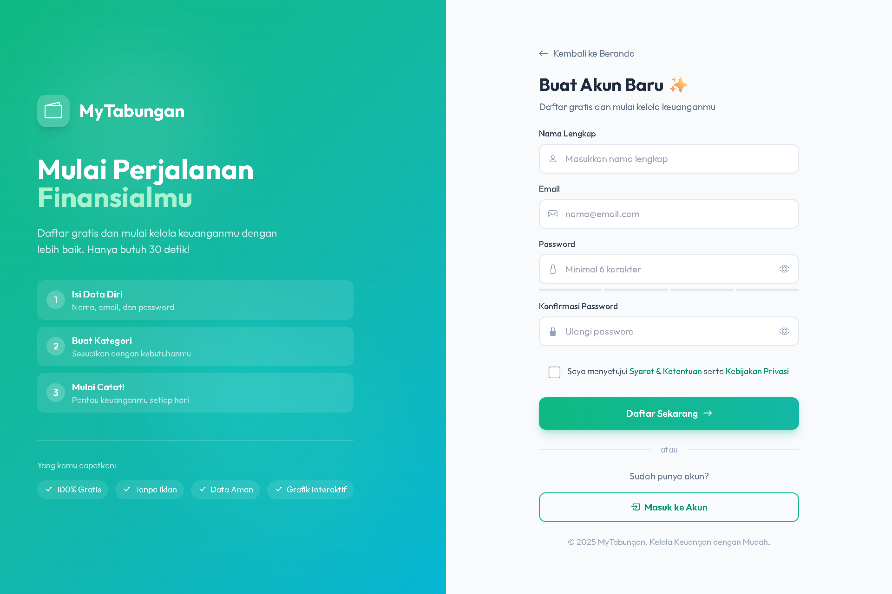 | 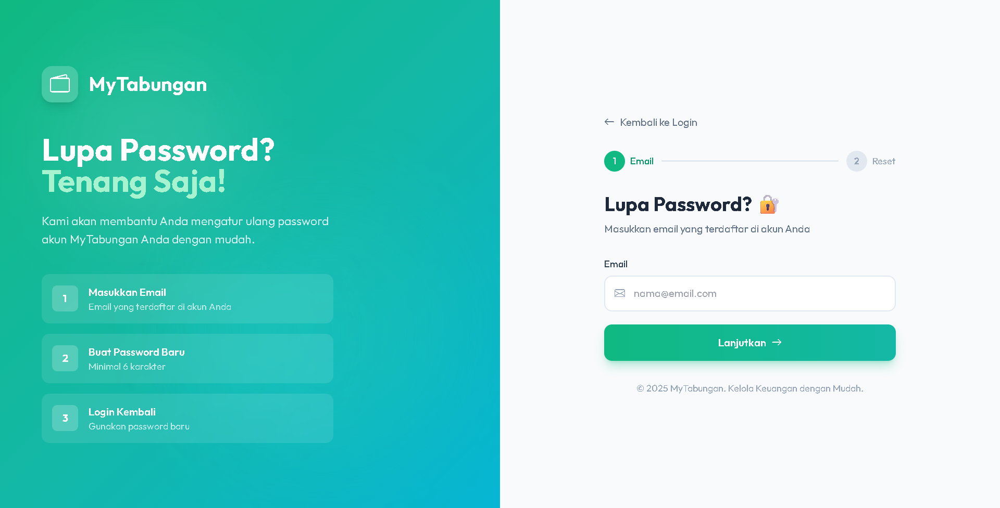 |

Sistem autentikasi lengkap untuk keamanan akun pengguna.

**🔑 Login** - Halaman untuk masuk ke akun:

- Form login dengan validasi email & password
- Remember me functionality
- Link ke halaman register dan lupa password
- Toast notification untuk feedback error/success

**📝 Register** - Halaman untuk mendaftar akun baru:

- Form registrasi dengan nama, email, dan password
- Validasi password minimal 6 karakter
- Harus menyetujui Terms & Privacy Policy
- Password di-hash menggunakan bcrypt

**🔓 Lupa Password** - Halaman untuk reset password:

- Masukkan email yang terdaftar
- Development mode: langsung set password baru
- Validasi email harus terdaftar di database

---

### 📊 Dashboard

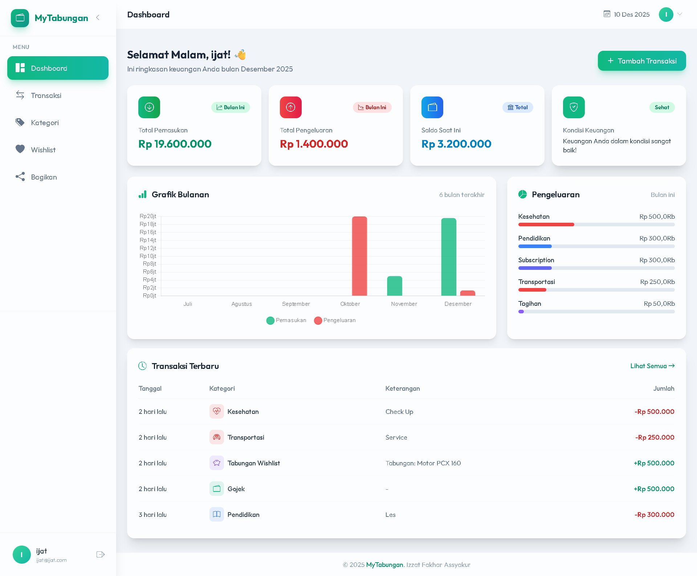

Pusat kontrol keuangan Anda! Halaman ini menampilkan ringkasan lengkap kondisi keuangan dalam satu tampilan.

**Fitur halaman ini:**

- ✅ **Ringkasan Keuangan** - Total pemasukan, pengeluaran, dan saldo
- ✅ **Grafik Tren Bulanan** - Visualisasi chart menggunakan Chart.js
- ✅ **Widget Kesehatan Finansial** - Indikator apakah keuangan sehat atau tidak
- ✅ **Transaksi Terbaru** - 5 transaksi terakhir yang dicatat
- ✅ **Quick Actions** - Shortcut untuk menambah transaksi baru

---

### 💰 Manajemen Transaksi

| Daftar Transaksi                       | Tambah Transaksi                                     |
| -------------------------------------- | ---------------------------------------------------- |
| 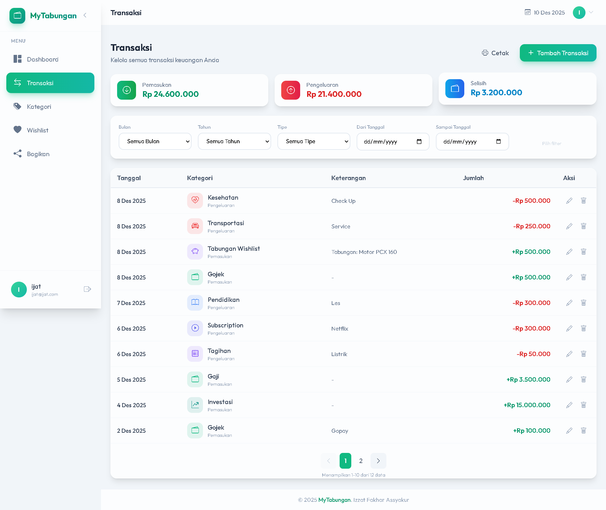 | 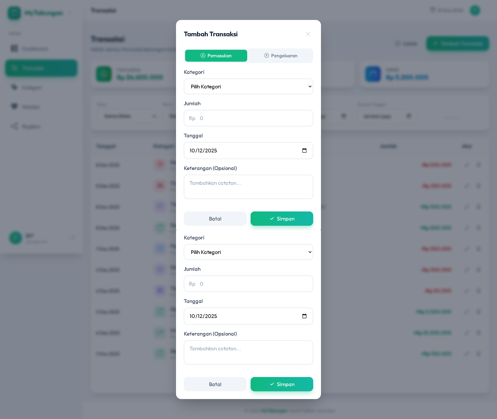 |

Halaman untuk mencatat dan mengelola semua transaksi keuangan Anda.

**📋 Daftar Transaksi** - Menampilkan riwayat semua transaksi:

- Filter berdasarkan bulan dan tahun
- Pagination untuk performa optimal saat data banyak
- Warna berbeda untuk pemasukan (hijau) dan pengeluaran (merah)
- Aksi edit dan hapus untuk setiap transaksi

**➕ Tambah Transaksi** - Modal form untuk mencatat transaksi baru:

- Pilih tipe: Pemasukan atau Pengeluaran
- Pilih kategori yang sudah dibuat
- Input jumlah, tanggal, dan keterangan
- Validasi input sebelum disimpan

---

### 🏷️ Kategori Kustom

| Daftar Kategori                      | Tambah Kategori                                    |
| ------------------------------------ | -------------------------------------------------- |
| 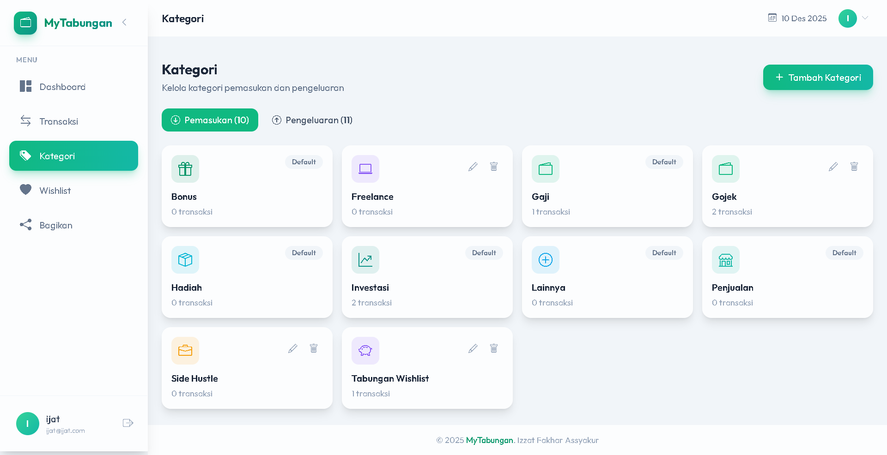 | 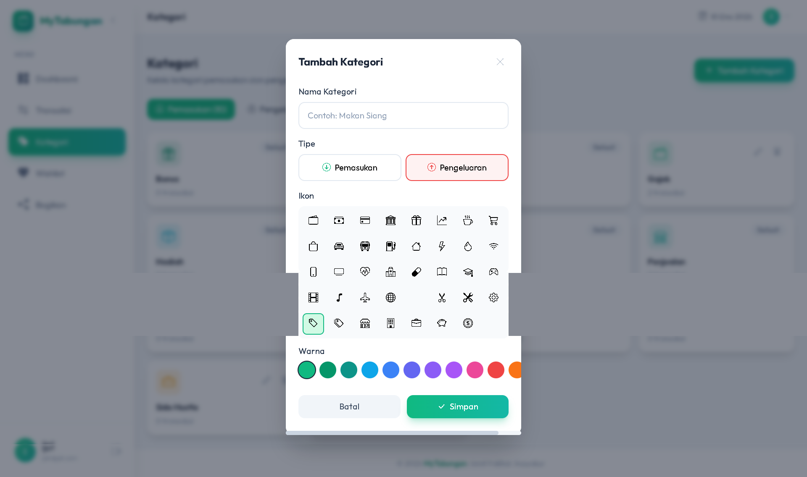 |

Kelola kategori untuk mengorganisir transaksi Anda dengan ikon dan warna custom.

**📂 Daftar Kategori** - Menampilkan semua kategori yang dibuat:

- Kategori dipisah antara Pemasukan & Pengeluaran
- Tampilan card dengan ikon dan warna
- Aksi edit dan hapus untuk setiap kategori

**➕ Tambah Kategori** - Form untuk membuat kategori baru:

- Pilih tipe kategori (Pemasukan/Pengeluaran)
- Masukkan nama kategori
- Icon picker dengan 50+ pilihan ikon Bootstrap
- Color picker untuk memilih warna custom

---

### 🎯 Wishlist & Target Tabungan

| Daftar Wishlist                      | Tambah Wishlist                                    |
| ------------------------------------ | -------------------------------------------------- |
| 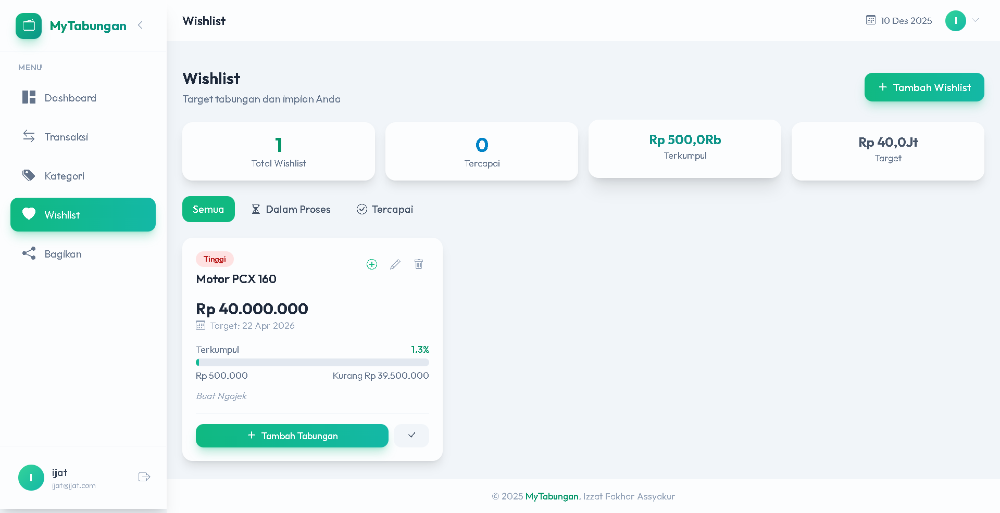 | 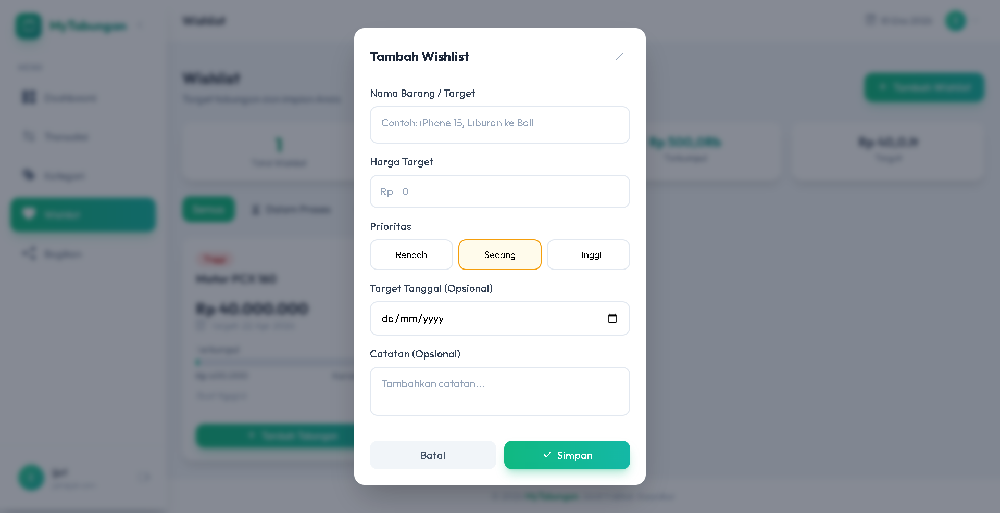 |

Fitur untuk menetapkan target tabungan dan memantau progress pencapaiannya.

**🎯 Daftar Wishlist** - Menampilkan semua target tabungan:

- Progress bar visual menunjukkan persentase tercapai
- Badge prioritas: Tinggi (merah), Sedang (kuning), Rendah (hijau)
- Status: Aktif atau Tercapai
- Update jumlah terkumpul dan mark sebagai tercapai

**➕ Tambah Wishlist** - Form untuk membuat target baru:

- Masukkan nama item yang diinginkan
- Set target jumlah uang yang dibutuhkan
- Pilih tingkat prioritas (Tinggi/Sedang/Rendah)
- Opsional: tambahkan catatan

---

### 🔗 Share Laporan Keuangan

| Manage Share Links                        | Laporan Shared                                 |
| ----------------------------------------- | ---------------------------------------------- |
| 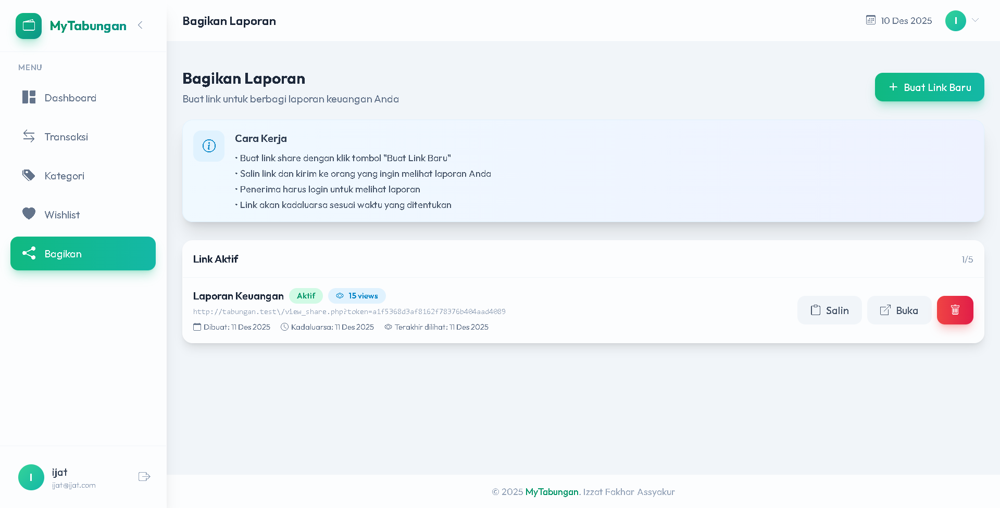 | 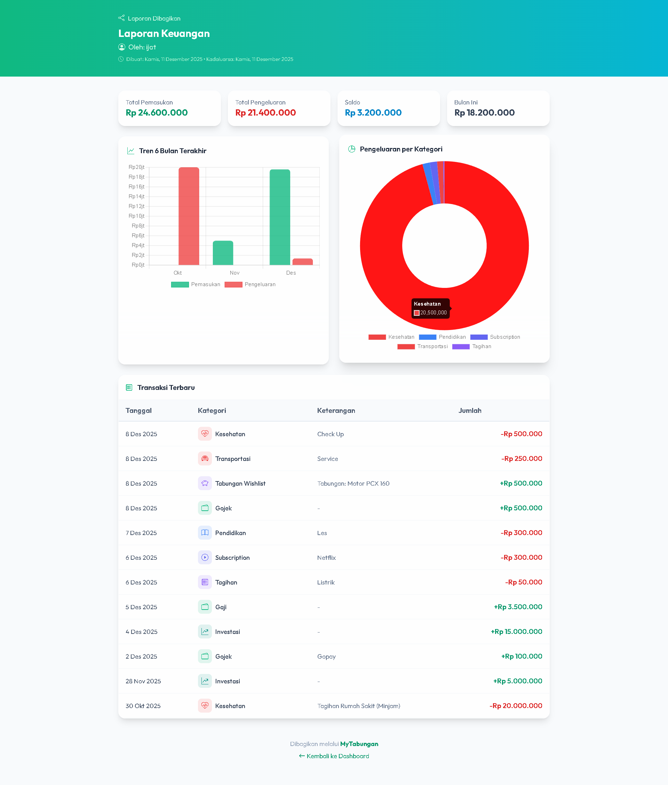 |

Bagikan laporan keuangan Anda dengan orang lain melalui link unik.

**🔗 Manage Share Links** - Kelola semua link share yang dibuat:

- Buat link baru dengan judul custom
- Set tanggal kadaluarsa (opsional)
- Copy link untuk dibagikan
- Lihat siapa saja yang sudah melihat (viewer tracking)
- Hapus link yang tidak dibutuhkan

**📊 Laporan Shared** - Tampilan publik yang dilihat penerima link:

- Ringkasan total pemasukan dan pengeluaran
- Bar chart visualisasi perbandingan
- Daftar transaksi dalam periode tertentu
- Tidak memerlukan login untuk melihat

---

### 👤 Profil & Pengaturan Akun

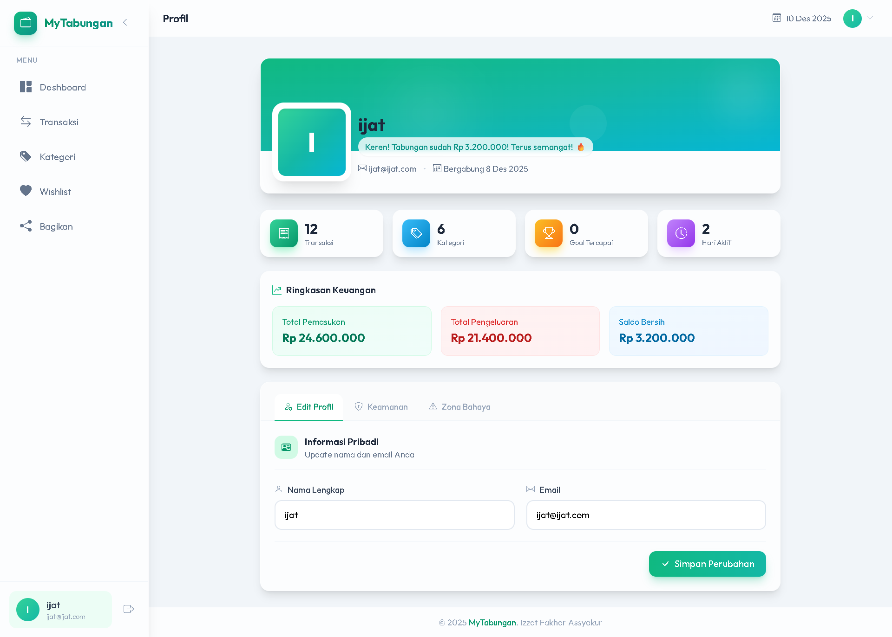

Halaman untuk mengelola profil dan pengaturan akun pengguna.

**Fitur halaman ini:**

- ✅ **Update Profil** - Ubah nama dan email
- ✅ **Motivational Quote** - Quote inspirasi berdasarkan total tabungan
- ✅ **Statistik Akun** - Jumlah transaksi, kategori, dan wishlist
- ✅ **Ganti Password** - Form untuk mengubah password dengan validasi
- ✅ **Zona Bahaya** - Hapus akun secara permanen (menghapus semua data)

---

### � Fully Responsive Design

Aplikasi dioptimasi untuk semua ukuran layar:

- ✅ **Desktop** - Sidebar collapsible di sisi kiri
- ✅ **Tablet** - Layout adaptif dengan sidebar yang bisa di-toggle
- ✅ **Mobile** - Bottom navigation untuk navigasi yang mudah dijangkau

---

## 🚀 Cara Penggunaan

### Prasyarat

- **XAMPP** / LAMP / WAMP dengan PHP 8.0+
- **MySQL 5.7+** atau MariaDB
- **Node.js & NPM** (untuk kompilasi Tailwind CSS)
- Browser modern (Chrome, Firefox, Edge)

### Langkah Instalasi

1. **Clone/Download ke folder htdocs**

   ```bash
   cd C:/xampp/htdocs
   git clone [repository-url] tabungan
   # atau download dan extract ke folder tabungan
   ```

2. **Buat database dan import schema**

   - Buka phpMyAdmin: http://localhost/phpmyadmin
   - Buat database baru: `tabungan`
   - Import file `database.sql`

   **Atau via command line:**

   ```bash
   mysql -u root -p tabungan < database.sql
   ```

3. **Konfigurasi database** (opsional)

   Edit `config/database.php` jika kredensial berbeda:

   ```php
   define('DB_HOST', 'localhost');
   define('DB_NAME', 'tabungan');
   define('DB_USER', 'root');
   define('DB_PASS', '');
   ```

4. **Install dependencies & compile Tailwind CSS**

   ```bash
   cd tabungan
   npm install
   npm run build
   ```

5. **Akses aplikasi**

   Buka browser: http://localhost/tabungan

### Development Mode

Jalankan Tailwind CSS watcher untuk auto-compile saat edit:

```bash
npm run dev
```

---

## 📖 Panduan Penggunaan

### 1. Registrasi Akun

- Buka http://localhost/tabungan
- Klik "Mulai Sekarang" atau "Daftar"
- Isi nama, email, dan password (min. 6 karakter)
- Setujui Terms & Privacy Policy

### 2. Menambah Kategori

- Masuk ke menu **Kategori**
- Klik "Tambah Kategori"
- Pilih tipe (Pemasukan/Pengeluaran)
- Pilih nama, ikon, dan warna

### 3. Mencatat Transaksi

- Masuk ke menu **Transaksi**
- Klik "Tambah Transaksi"
- Pilih tipe, kategori, jumlah, tanggal, dan keterangan

### 4. Membuat Wishlist

- Masuk ke menu **Wishlist**
- Klik "Tambah Wishlist"
- Isi nama item, target uang, dan prioritas
- Update progress saat menabung

### 5. Share Laporan

- Masuk ke menu **Share**
- Klik "Buat Link Share"
- Set judul dan tanggal kadaluarsa (opsional)
- Copy link dan bagikan

### 6. Lupa Password

- Di halaman login, klik "Lupa password?"
- Masukkan email terdaftar
- (Development mode: langsung set password baru)

### 7. Hapus Akun

- Masuk ke **Profil** → Tab "Zona Bahaya"
- Masukkan password untuk konfirmasi
- Klik "Hapus Akun" (PERMANEN!)

---

## 🛠️ Tech Stack

| Komponen      | Teknologi              | Versi |
| ------------- | ---------------------- | ----- |
| Backend       | PHP Native (PDO)       | 8.0+  |
| Database      | MySQL                  | 5.7+  |
| CSS Framework | Tailwind CSS           | 3.4+  |
| JavaScript    | Vanilla JS (ES6+)      | -     |
| Charts        | Chart.js               | 4.0+  |
| Icons         | Bootstrap Icons        | 1.11+ |
| Fonts         | Google Fonts (Outfit)  | -     |
| Build Tool    | PostCSS + Tailwind CLI | -     |

---

## 📁 Struktur Folder

```
tabungan/
├── assets/
│   ├── css/
│   │   ├── input.css          # Tailwind source
│   │   └── styles.css         # Compiled CSS
│   ├── img/                   # Screenshots & images
│   └── js/
│       ├── core.js            # Core utilities
│       ├── sidebar.js         # Sidebar logic
│       ├── modal.js           # Modal handling
│       ├── forms.js           # Form utilities
│       ├── ui.js              # UI components
│       └── charts.js          # Chart.js init
├── auth/
│   └── auth.php               # Authentication functions
├── config/
│   └── database.php           # Database configuration
├── includes/
│   └── functions.php          # Helper functions
├── layout/
│   ├── header.php             # HTML head
│   ├── sidebar.php            # Sidebar + mobile nav
│   └── footer.php             # Footer + scripts
├── index.php                  # Landing page
├── dashboard.php              # User dashboard
├── login.php                  # Login page
├── register.php               # Register page
├── forgot_password.php        # Password reset
├── transaksi.php              # Transactions
├── kategori.php               # Categories
├── wishlist.php               # Wishlist/goals
├── share.php                  # Share management
├── view_share.php             # Public shared report
├── profil.php                 # User profile
├── terms.php                  # Terms & Conditions
├── privacy.php                # Privacy Policy
├── database.sql               # Database schema
├── tailwind.config.js         # Tailwind config
├── postcss.config.js          # PostCSS config
└── package.json               # NPM dependencies
```

---

## 🗄️ Database Schema

### Tables

| Table           | Deskripsi                                                                     |
| --------------- | ----------------------------------------------------------------------------- |
| `pengguna`      | Data user (id, nama, email, password, created_at)                             |
| `kategori`      | Kategori transaksi (id, nama, tipe, ikon, warna, id_pengguna)                 |
| `transaksi`     | Data transaksi (id, jumlah, tanggal, keterangan, id_kategori, id_pengguna)    |
| `wishlist`      | Target tabungan (id, nama, target, terkumpul, prioritas, status, id_pengguna) |
| `share_token`   | Share links (id, token, title, expires_at, id_pengguna)                       |
| `share_viewers` | Viewer tracking (id, id_share, id_pengguna, viewed_at)                        |

---

## 🔒 Keamanan

- ✅ Password hashing dengan `password_hash()` (bcrypt)
- ✅ Prepared statements (PDO) untuk mencegah SQL Injection
- ✅ `htmlspecialchars()` untuk mencegah XSS
- ✅ Session-based authentication
- ✅ CSRF protection pada forms
- ✅ Validasi input (email, password length)

---

## 🤝 Kontribusi

Kontribusi sangat diterima! Silakan:

1. Fork repository ini
2. Buat branch fitur (`git checkout -b fitur-baru`)
3. Commit perubahan (`git commit -m 'Tambah fitur baru'`)
4. Push ke branch (`git push origin fitur-baru`)
5. Buat Pull Request

---

## 📄 Lisensi

Proyek ini dilisensikan di bawah [MIT License](LICENSE).

---

## 👨‍💻 Author

**Izzat Fakhar Assyakur -221011400803 - 07TPLP020**

- GitHub: [@ijatt19](https://github.com/ijatt19)
- Dibuat sebagai proyek pembelajaran PHP & Web Development

---

<div align="center">

**Dibuat Untuk Memenuhi Tugas Pemrograman Web 2**

© 2024 MyTabungan. All rights reserved.

</div>
