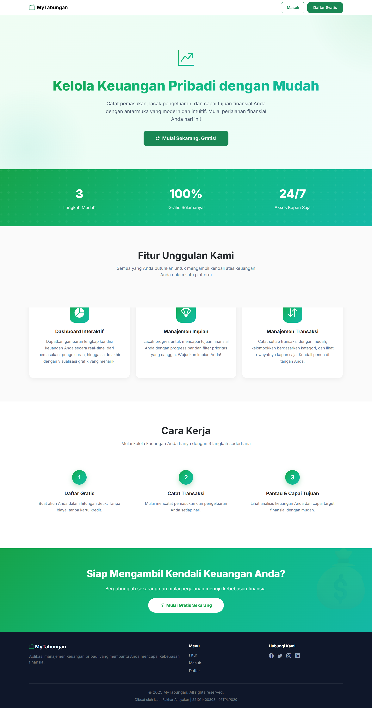
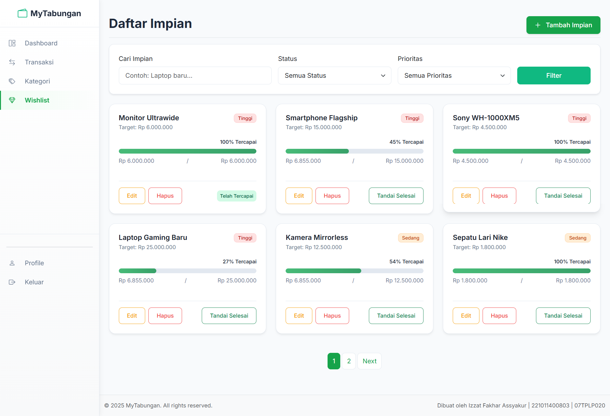
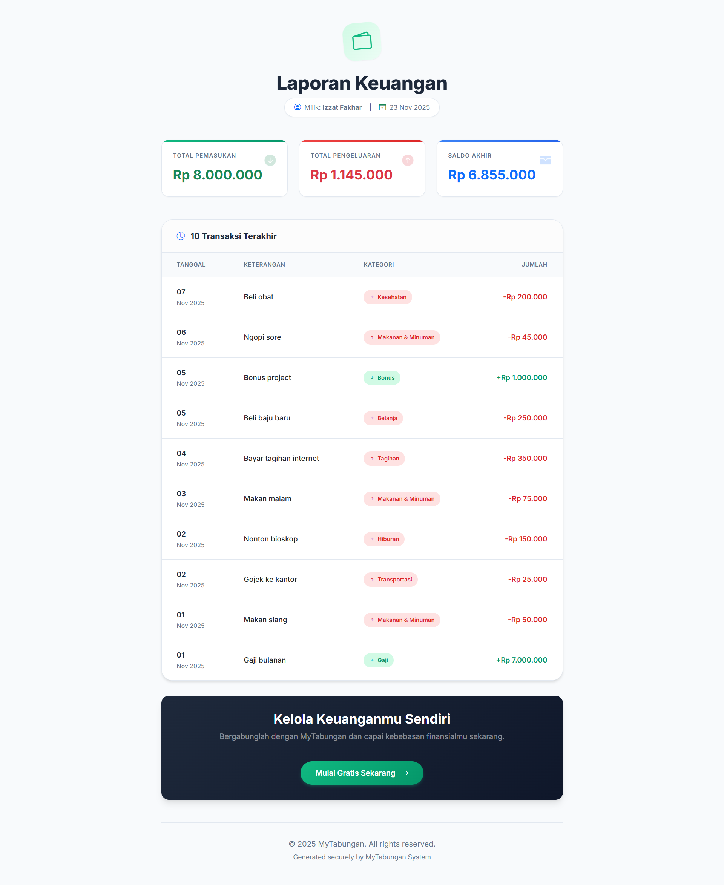
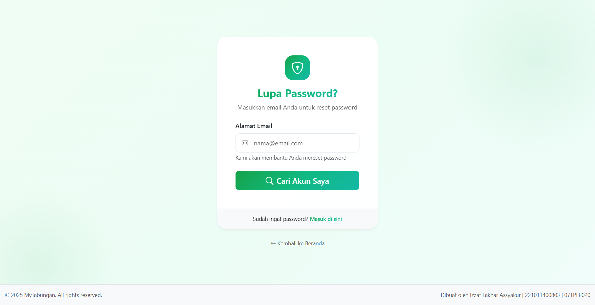

# MyTabungan - Aplikasi Manajemen Keuangan Pribadi 💰

MyTabungan adalah aplikasi web sederhana namun powerful untuk membantu Anda mengelola keuangan pribadi. Dengan fitur pencatatan pemasukan, pengeluaran, serta penetapan target impian (wishlist), MyTabungan memudahkan Anda mencapai kebebasan finansial.



## ✨ Fitur Utama

### 1. Dashboard Interaktif
Ringkasan keuangan Anda dalam satu pandangan. Grafik pemasukan vs pengeluaran, saldo saat ini, dan ringkasan transaksi terakhir.


### 2. Manajemen Transaksi
Catat setiap pemasukan dan pengeluaran dengan mudah. Filter berdasarkan tanggal dan kategori untuk analisis yang lebih mendalam.


### 3. Kelola Kategori
Kustomisasi kategori pemasukan dan pengeluaran sesuai kebutuhan Anda.


### 4. Wishlist (Target Impian)
Tetapkan target barang impian Anda, atur prioritas, dan pantau progress tabungan Anda.


### 5. Laporan Publik & Berbagi
Bagikan laporan keuangan Anda secara aman dengan link khusus yang digenerate otomatis.


### 6. Sistem Autentikasi Lengkap
Fitur Login, Register, dan Lupa Password dengan desain modern dan aman.
<div style="display: flex; gap: 10px; flex-wrap: wrap;">
  
  
  
</div>

### 7. Profil Pengguna
Kelola informasi akun dan keamanan password Anda dengan mudah.


## 🛠️ Teknologi yang Digunakan

*   **Backend**: PHP Native (PDO)
*   **Database**: MySQL
*   **Frontend**: HTML5, CSS3, JavaScript
*   **Framework CSS**: Bootstrap 5.3
*   **Icons**: Bootstrap Icons
*   **Font**: Inter (Google Fonts)
*   **Chart**: Chart.js

## 🚀 Cara Instalasi

1.  **Clone Repository**
    ```bash
    git clone https://github.com/username/mytabungan.git
    ```
2.  **Siapkan Database**
    *   Buat database baru di phpMyAdmin bernama `tabungan_db` (atau sesuai konfigurasi).
    *   Import file database `.sql` yang disertakan (jika ada) atau jalankan migrasi.
3.  **Konfigurasi Koneksi**
    *   Buka `config/koneksi.php`.
    *   Sesuaikan host, user, password, dan nama database.
4.  **Jalankan Aplikasi**
    *   Pastikan XAMPP/Apache berjalan.
    *   Akses `http://localhost/tabung` di browser Anda.

## 📝 Lisensi

Dibuat oleh **Izzat Fakhar Assyakur**.
Project ini dibuat untuk tujuan pembelajaran dan manajemen keuangan pribadi.

---
*Happy Saving!* 💸
