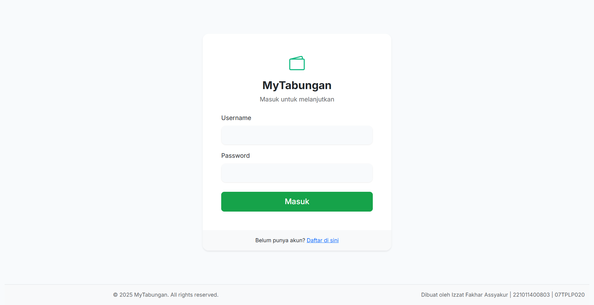
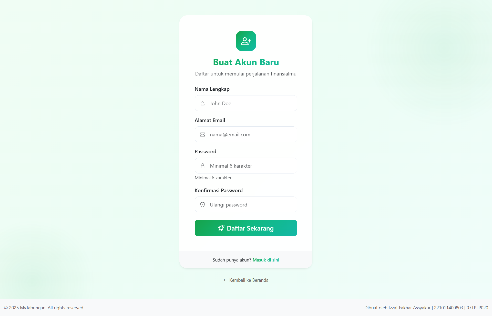
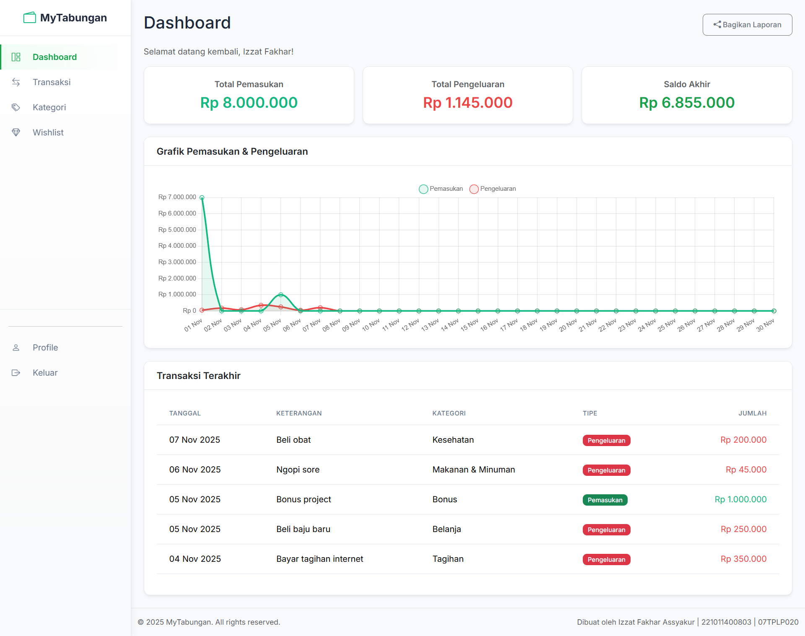
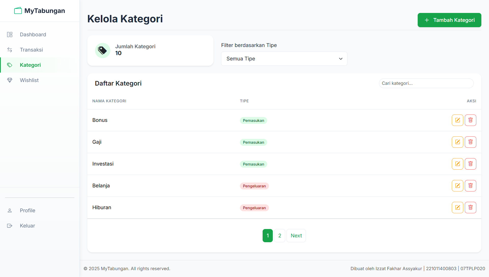
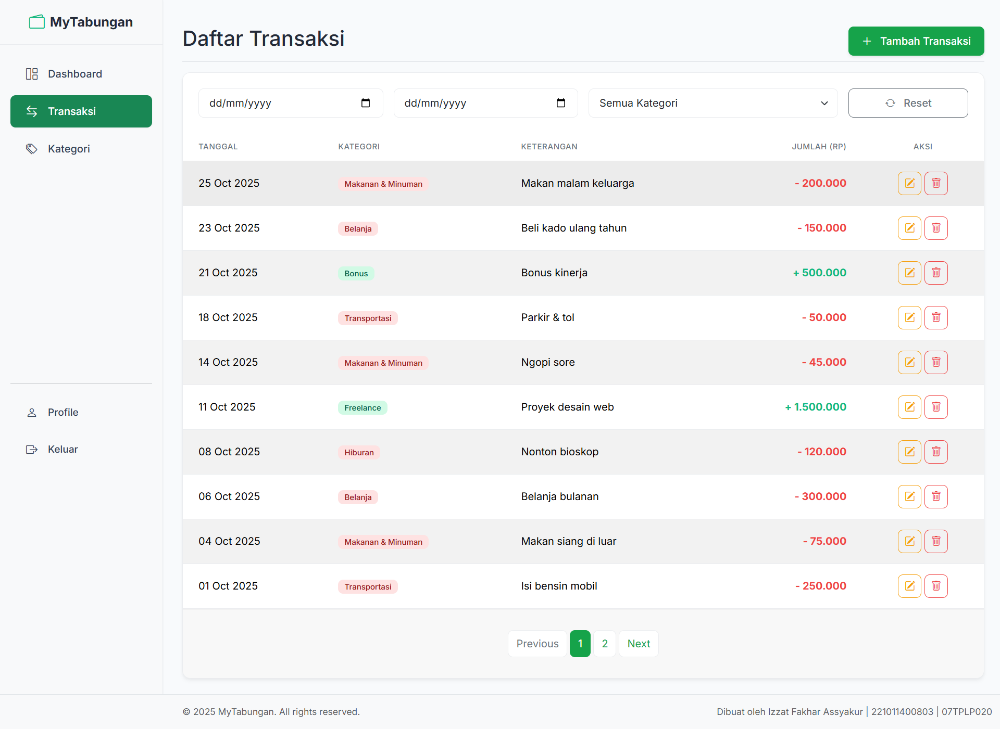
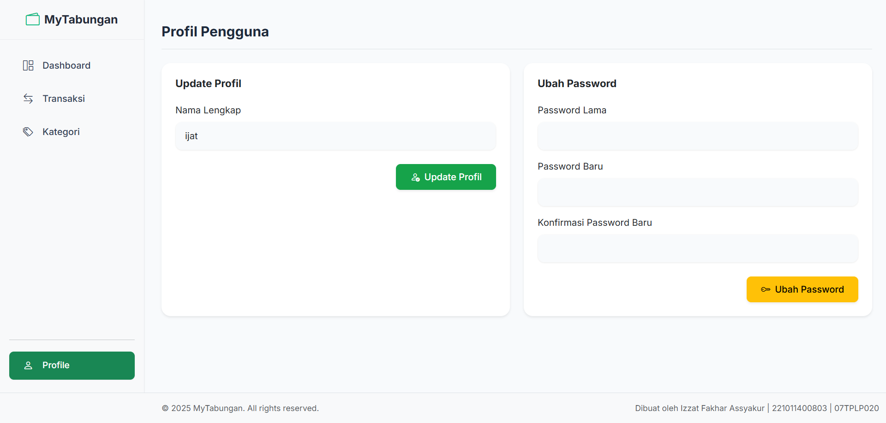

## Izzat Fakhar Assyakur - 221011400803 - 07TPLP020

# Tabung — Aplikasi Manajemen Tabungan

Aplikasi web sederhana untuk mengelola tabungan pribadi, termasuk kategori tabungan, transaksi pemasukan/pengeluaran, serta ringkasan di dashboard. Mendukung autentikasi pengguna (login/register) dan pengelolaan profil.

## Fitur

- Autentikasi pengguna: Login dan Register
- Pengelolaan Profil
- CRUD Kategori Tabungan
- CRUD Transaksi (Pemasukan/Pengeluaran)
- Dashboard ringkasan dan grafik
- Modal konfirmasi tindakan

## Teknologi

- PHP (Native)
- MySQL
- HTML, CSS, JavaScript

## Instalasi

1. Pastikan XAMPP/WAMP atau server PHP + MySQL tersedia.
2. Import database:
   - File SQL: `mytabungan.sql`
3. Konfigurasi koneksi database:
   - Edit file: `config/koneksi.php`
   - Sesuaikan host, username, password, dan nama database.
4. Jalankan aplikasi melalui browser (contoh): `http://localhost/tabung`

## Cuplikan Layar

Berikut beberapa tampilan utama aplikasi:

- Halaman Login
  

- Halaman Register
  

- Dashboard
  

- Kategori Tabungan
  

- Transaksi
  

- Profil
  

## Lisensi

Proyek ini untuk keperluan belajar/personal.

